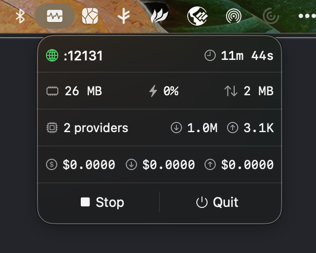

<p align="center">
  
</p>

<h1 align="center">zig-zag</h1>

<p align="center">
  <strong>⚡ Blazing-fast LLM proxy written in Zig</strong>
</p>

<p align="center">
  <a href="#features">Features</a> •
  <a href="#quick-start">Quick Start</a> •
  <a href="#macos-app">macOS App</a> •
  <a href="#configuration">Configuration</a> •
  <a href="#api">API</a>
</p>

---

## Why zig-zag?

- **🚀 Ultra-fast**: Written in Zig for maximum performance with minimal memory footprint (~21MB)
- **🔌 Universal**: One OpenAI-compatible API for all your LLM providers
- **🔄 Real-time**: Full SSE streaming support with protocol translation
- **🎯 Zero config**: Works out of the box, just add your API keys
- **🖥️ Native macOS app**: Beautiful menu bar app with real-time stats

## Features

| Feature | Description |
|---------|-------------|
| **OpenAI-Compatible API** | Drop-in replacement for any OpenAI client |
| **Multi-Provider** | OpenAI, Anthropic, SAP AI Core, SAP HAI, and any compatible provider |
| **Unified Namespace** | Access all models via `{provider}/{model}` format |
| **Streaming** | Full SSE streaming with automatic protocol translation |
| **Real-time Metrics** | CPU, memory, network I/O, token usage, and cost tracking |
| **Cross-platform** | macOS (native app), Linux |

## Supported Providers

| Provider | Type | Description |
|----------|------|-------------|
| `openai` | Native | OpenAI API (GPT-4, GPT-4o, etc.) |
| `anthropic` | Native | Anthropic Messages API (Claude 3.5, Claude 4) |
| `sap_ai_core` | Native | SAP AI Core with OAuth client credentials |
| `hai` | Native | SAP HAI with OIDC browser auth + OAuth token refresh |
| `copilot` | Native | GitHub Copilot with OAuth device flow + automatic token exchange |
| Any | Compatible | OpenAI/Anthropic-compatible APIs (Groq, Azure, Together, etc.) |

## Quick Start

### 1. Build

```bash
zig build
```

### 2. Configure

Create `~/.config/zig-zag/config.json`:

```json
{
  "providers": {
    "anthropic": {
      "api_key": "sk-ant-your-key"
    },
    "openai": {
      "api_key": "sk-your-key"
    }
  }
}
```

### 3. Run

```bash
zig build run
```

### 4. Use

```bash
# Chat completion
curl http://localhost:8080/v1/chat/completions \
  -H "Content-Type: application/json" \
  -d '{
    "model": "anthropic/claude-sonnet-4-20250514",
    "messages": [{"role": "user", "content": "Hello!"}]
  }'

# With streaming
curl http://localhost:8080/v1/chat/completions \
  -H "Content-Type: application/json" \
  -d '{
    "model": "openai/gpt-4o",
    "messages": [{"role": "user", "content": "Hello!"}],
    "stream": true
  }'

# List all models
curl http://localhost:8080/v1/models
```

## macOS App

zig-zag comes with a native macOS menu bar app for easy server management.

<p align="center">
  
</p>

**Features:**
- One-click start/stop server
- Real-time statistics:
  - 💾 Memory usage (actual footprint, like `top`)
  - ⚡ CPU usage (calculated per-second)
  - 📊 Network I/O (rx/tx bytes)
  - 🔢 Token usage (input/output separately)
  - 💰 Cost tracking (input/output separately)
- Keyboard shortcuts (⌘Q to quit)

### Build the macOS App

```bash
# Build the Zig library
zig build lib:rls

# Open in Xcode and build
open ui/macos/zig-zag/zig-zag.xcodeproj
```

## API Endpoints

| Endpoint | Method | Description |
|----------|--------|-------------|
| `/v1/chat/completions` | POST | Chat completion (streaming & non-streaming) |
| `/v1/models` | GET | List available models from all providers |

## Configuration

### Server Options

```json
{
  "server": {
    "host": "0.0.0.0",
    "port": 8080,
    "http_pool_size": 8,
    "io_pool_size": 4
  },
  "logging": {
    "level": "info",
    "path": null,
    "max_file_size_mb": 10,
    "max_files": 5,
    "buffer_size": 100,
    "flush_interval_ms": 1000
  }
}
```

| Option | Type | Default | Description |
|--------|------|---------|-------------|
| `server.host` | string | `"0.0.0.0"` | Server bind address |
| `server.port` | number | `8080` | Server port |
| `server.http_pool_size` | number | auto | HTTP connection pool size |
| `server.io_pool_size` | number | auto | I/O worker pool size |
| `logging.level` | string | `"info"` | Log level: `debug`, `info`, `warn`, `err` |
| `logging.path` | string | `null` | Log file path (null for OS default) |
| `logging.max_file_size_mb` | number | `10` | Max log file size before rotation |
| `logging.max_files` | number | `5` | Number of rotated log files to keep |
| `logging.buffer_size` | number | `100` | Messages to buffer before flush |
| `logging.flush_interval_ms` | number | `1000` | Auto-flush interval in ms |

### Provider Examples

#### Anthropic

```json
{
  "anthropic": {
    "api_key": "sk-ant-your-key"
  }
}
```

#### OpenAI

```json
{
  "openai": {
    "api_key": "sk-your-key"
  }
}
```

#### SAP AI Core

```json
{
  "sap_ai_core": {
    "api_domain": "https://api.ai.prod.us-east-1.aws.ml.hana.ondemand.com",
    "deployment_id": "your-deployment-id",
    "resource_group": "your-resource-group",
    "oauth_domain": "https://your-tenant.authentication.us10.hana.ondemand.com",
    "oauth_client_id": "your-client-id",
    "oauth_client_secret": "your-client-secret"
  }
}
```

#### SAP HAI

```json
{
  "hai": {
    "api_url": "https://api.hyperspace.tools.sap",
    "client_id": "your-oidc-client-id",
    "auth_domain": "https://your-tenant.accounts400.ondemand.com",
    "oidc_config_path": "/.well-known/openid-configuration",
    "redirect_port": 8335,
    "redirect_path": "/auth-code",
    "models_path": "/v1/models",
    "chat_completions_path": "/v1/chat/completions"
  }
}
```

> **Note:** HAI uses OIDC browser-based authentication. On first use, a browser window opens for login. Tokens are cached and automatically refreshed.

#### GitHub Copilot

```json
{
  "copilot": {}
}
```

No configuration needed! zig-zag reads your existing GitHub Copilot token from `~/.config/github-copilot/apps.json` (installed by VS Code, JetBrains, etc.). If no token is found, a browser-based device flow is initiated automatically.

> **Note:** Requires an active GitHub Copilot subscription. The Copilot API token is short-lived (~30 min) and automatically refreshed via the OAuth token. `api_base` is dynamic — returned by the token exchange endpoint.

Optional overrides:

```json
{
  "copilot": {
    "client_id": "Iv1.b507a08c87ecfe98",
    "editor_version": "vscode/1.95.0",
    "editor_plugin_version": "copilot-chat/0.26.7",
    "user_agent": "GitHubCopilotChat/0.26.7",
    "api_version": "2025-04-01"
  }
}
```

#### Compatible Providers (Groq, Azure, etc.)

```json
{
  "groq": {
    "api_key": "gsk-your-key",
    "api_url": "https://api.groq.com/openai",
    "compatible": "openai"
  }
}
```

### Provider Options Reference

| Option | Type | Default | Description |
|--------|------|---------|-------------|
| `api_key` | string | - | API key for authentication |
| `api_url` | string | Provider default | Base URL for API |
| `compatible` | string | - | `"openai"` or `"anthropic"` for compatible providers |
| `max_response_size_mb` | number | `10` | Maximum response size in MB |
| `retry_count` | number | `0` | Retry attempts on failure |
| `retry_delay_ms` | number | `1000` | Delay between retries |

## Model Naming

All models use the `{provider}/{model}` format:

```
anthropic/claude-sonnet-4-20250514
anthropic/claude-3-5-sonnet-latest
openai/gpt-4o
openai/gpt-4-turbo
sap_ai_core/gpt-4o
hai/anthropic--claude-4.5-opus
copilot/gpt-4o
copilot/claude-sonnet-4.5
groq/llama-3.1-70b-versatile
```

## Development

### Build

```bash
# Build and run (default)
zig build run

# Build debug executable
zig build exec:dbg

# Build release executable (smallest size)
zig build exec:rls

# Build debug library (for macOS app development)
zig build lib:dbg

# Build release library (for macOS app distribution)
zig build lib:rls
```

### Run Tests

```bash
# Integration tests
zig build test
```

### Version

The version is defined in `version.txt` at the project root (single source of truth). It is embedded at compile time into both the CLI binary and the shared library.

```bash
# Check current version
just current-version

# Check version from built binary
./zig-out/bin/zig-zag --version
```

### Releasing

```bash
# Bump version (updates version.txt + Xcode project, commits, tags)
just release patch   # 0.3.1 → 0.3.2
just release minor   # 0.3.2 → 0.4.0
just release major   # 0.4.0 → 1.0.0

# Push to trigger GitHub Actions release
just push-release
```

### Project Structure

```
├── version.txt               # Version (single source of truth)
├── src/
│   ├── main.zig              # CLI entry point (--version flag)
│   ├── lib.zig               # Library entry point (C API for macOS app)
│   ├── server.zig            # HTTP server
│   ├── router.zig            # Request routing
│   ├── config.zig            # Configuration loader
│   ├── client.zig            # HTTP client for upstream providers
│   ├── curl.zig              # Curl-based HTTP client (for TLS-constrained servers)
│   ├── http.zig              # HTTP utilities
│   ├── metrics.zig           # Metrics tracking (CPU, memory, tokens, costs)
│   ├── log.zig               # Logging system
│   ├── errors.zig            # Error types
│   ├── utils.zig             # Utilities
│   ├── provider.zig          # Provider abstraction
│   ├── worker_pool.zig       # Thread pool for concurrent requests
│   ├── auth/                 # Authentication modules
│   │   ├── mod.zig           # Auth module exports
│   │   ├── oidc.zig          # OIDC discovery
│   │   ├── oauth.zig         # OAuth token exchange & refresh
│   │   ├── pkce.zig          # PKCE challenge generation
│   │   └── callback_server.zig  # Local callback server for browser auth
│   ├── cache/
│   │   ├── token_cache.zig   # OAuth token caching
│   │   └── app_cache.zig     # Application-level cache (models, OIDC config)
│   ├── handlers/
│   │   ├── chat.zig          # /v1/chat/completions handler
│   │   └── models.zig        # /v1/models handler
│   └── providers/
│       ├── openai/           # OpenAI provider (client, transformer, types)
│       ├── anthropic/        # Anthropic provider (client, transformer, types)
│       ├── sap_ai_core/      # SAP AI Core provider (client, transformer, types)
│       ├── hai/              # SAP HAI provider (client only, uses OpenAI types)
│       └── copilot/          # GitHub Copilot provider (client + device flow HTML)
├── include/
│   └── zig-zag.h             # C header for FFI
├── ui/
│   └── macos/                # Native macOS menu bar app (Swift)
└── test/
    ├── cases/                # Integration test cases
    └── integration/          # Integration test framework
```

## Performance

zig-zag is designed for minimal resource usage:

| Metric | Value |
|--------|-------|
| Memory footprint | ~21 MB |
| Startup time | < 10ms |
| Request latency overhead | < 1ms |
| Binary size | ~2 MB |

## License

Apache License 2.0 - See [LICENSE](LICENSE) and [NOTICE](NOTICE) for details.

---

<p align="center">
  Made with ⚡ and 🦎 Zig
</p>
